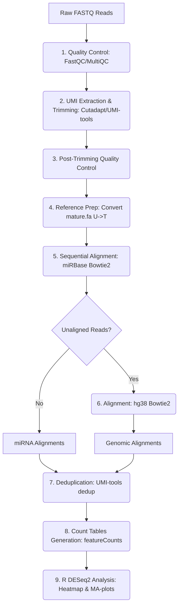

# 🧬 miRNA-Seq Bioinformatics Pipeline (Academic Project)
> **A didactic implementation of Differential Expression Analysis (DEA) for small RNA-seq data**

[](https://opensource.org/licenses/MIT)
[](#-setup-and-installation)
[](https://www.python.org/)
[](https://www.r-project.org/)

This project was developed as part of the **Bioinformatics** exam (Academic Year 2023/2024) at the **University of L'Aquila (UNIVAQ)**.

The bioinformatics pipeline automates the preprocessing, alignment, and differential statistical analysis of miRNA sequencing data. The workflow integrates quality control, UMI extraction, sequential double alignment (against the miRBase database and the hg38 reference genome), and the study of differential gene regulation (DEA) between different biological conditions.

---

## 🗺️ Pipeline Workflow
The flowchart below illustrates the sequential steps executed by the pipeline:



---

## 📁 Directory Structure
The project is structured as follows to ensure proper organization of input and output files:

```text
.
├── annotation_files/         # Annotation files (.gff3)
├── data/                     # Folder for raw and intermediate data (ignored by git)
│   └── raw/
│       ├── Run1/
│       ├── Run2/
│       └── Run3/
├── reference/                # Indexes and references for alignment (ignored by git)
│   ├── hg38/
│   └── miRBase/
├── results/                  # Final generated results
│   ├── DEA/                  # Differential expression analysis (Heatmap, MA-plot, CSV)
│   └── counts/               # Merged count matrices
├── scripts/                  # Pipeline source code
└── pipeline.sh               # Main pipeline execution script
```

---

## 🛠️ Setup and Installation

### 1. Prerequisites
Ensure you have **Miniconda** or **Anaconda** installed on your system.

### 2. Environment Creation
The complete working environment containing all bioinformatics tools (Bowtie2, Samtools, Cutadapt, R, DESeq2, etc.) can be configured using a single command:

```bash
conda env create -f environment.yml
conda activate bioinfo_pipeline
```

### 3. Required Files
Before running the analysis, you need to acquire the following files:
* **Raw Data (FASTQ)**: place under `data/raw/` divided into their respective sub-directories `Run1`, `Run2`, `Run3`.
* **mature.fa**: download from [miRBase](https://www.mirbase.org/download/) and place in `reference/`.
* **GRCh38 Indexes**: Bowtie2 index files downloadable from [Bowtie2 Indexes](https://bowtie-bio.sourceforge.net/bowtie2/index.shtml) and placed under `reference/hg38/`.
* **hsa.gff3**: download from [miRBase](https://www.mirbase.org/download/) and place in `annotation_files/`.

---

## 🚀 Execution

You can run the entire pipeline using the main script:

```bash
bash pipeline.sh
```

Alternatively, you can run individual modules in order:

| Order | Script | Description |
| :---: | :--- | :--- |
| **1** | [quality_before_trimming.sh](scripts/quality_before_trimming.sh) | Initial quality control with FastQC and MultiQC |
| **2** | [trimming.sh](scripts/trimming.sh) | UMI extraction and adapter removal with Cutadapt |
| **3** | [quality_after_trimming.sh](scripts/quality_after_trimming.sh) | Post-trimming quality control |
| **4** | [convert.sh](scripts/convert.sh) | Conversion of `mature.fa` (from U to T) and human miRNA extraction |
| **5** | [align_to_miRBase.sh](scripts/align_to_miRBase.sh) | Bowtie2 alignment to miRBase and extraction of unaligned reads |
| **6** | [align_to_hg38.sh](scripts/align_to_hg38.sh) | hg38 alignment and BAM conversion/sorting |
| **7** | [qualimap.sh](scripts/qualimap.sh) | Alignment quality analysis with Qualimap |
| **8** | [rename.sh](scripts/rename.sh) | Automatic BAM renaming for downstream analysis |
| **9** | [miRBase_counts.sh](scripts/miRBase_counts.sh) | Count computation for miRBase alignment |
| **10**| [hg38_featurecounts.sh](scripts/hg38_featurecounts.sh) | Genomic count computation with featureCounts |
| **11**| [mergeCounts.py](scripts/mergeCounts.py) | Genomic and microRNA count merging |
| **12**| [dea.R](scripts/dea.R) | Statistical analysis with DESeq2 and plot generation |

---

## 📊 Results and Analysis

> [!WARNING]
> The primary goal of this project is the design, implementation, and execution of the bioinformatics pipeline itself. The generated biological results (differential expression, heatmap, etc.) have not undergone scientific validation or review, and should not be taken as a direct reference or clinical/scientific truth.

The differential expression analysis (DEA) performed on the samples generated the final plots and tables saved in `results/DEA/`.

### Academic Material and Exam Reports
* 📄 **Complete Report**: [Report.pdf](Report.pdf) — Theoretical details, biological methodology, and discussion of results.

---

## 👥 Authors
This project was carried out in collaboration by the following students:
* **Marco Di Francescantonio** (Repository owner)
* **Francisco Javier Macias Villaecija**
* **Lamin Chatty**

---

## 📚 References
1. **Biostars**: Bioinformatics resource thread. [https://www.biostars.org/p/9539851/](https://www.biostars.org/p/9539851/) (Accessed: 2024-07-02).
2. **Mitchell, P. S., Parkin, R. K., et al.** (2008). *Circulating microRNAs as stable blood-based markers for cancer detection*. Proceedings of the National Academy of Sciences, 105(30), 10513-10518.
3. **Neurobioinfo**: miRNA workflow. [https://github.com/neurobioinfo/miRNA_workflow](https://github.com/neurobioinfo/miRNA_workflow) (Accessed: 2024-07-02).
4. **Potla, P., Ali, S. A., & Kapoor, M.** (2021). *A bioinformatics approach to microRNA-sequencing analysis*. Osteoarthritis and Cartilage Open, 3(1), 100131.
5. **Xia, L., Guo, H., et al.** (2023). *Human circulating small non-coding RNA signature as a non-invasive biomarker in clinical diagnosis of acute myeloid leukaemia*. Theranostics, 13(4), 1289.

---

## ⚖️ License
This project is distributed under the MIT License. See the [LICENSE](LICENSE) file for details.
